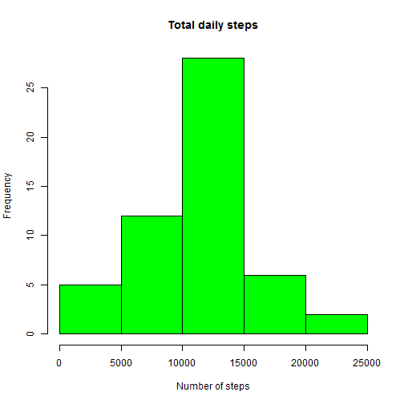
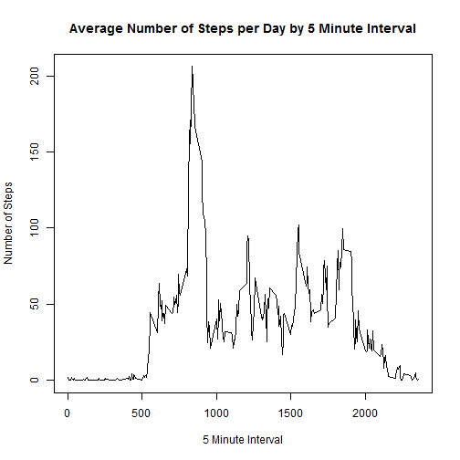
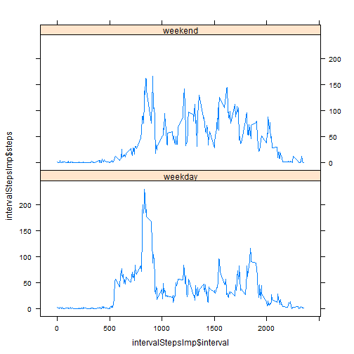

###Loading and preprocessing the data

```r
setwd("C:/Rob/courses etc/Data Science/REPRODUCIBLE_RESEARCH/Assignment1")
myData <- read.csv("activity.csv")
```

###What is the mean total number of steps taken per day?

Code for calculating the total number of steps per day:

```r
dailySteps <- aggregate(steps~date,myData,sum)
meanDailySteps <- mean(dailySteps$steps)
medianDailySteps <- median(dailySteps$steps)
```

Histogram of total daily steps:

```r
hist(dailySteps$steps,main ="Total daily steps",xlab="Number of steps",col="green")
```



Mean total number of steps taken per day:

```r
meanDailySteps
```

```
## [1] 10766.19
```
Median total number of steps taken per day:

```r
medianDailySteps
```

```
## [1] 10765
```
###What is the average daily activity pattern?

```r
intervalSteps <- aggregate(steps~interval,myData,mean)
plot(intervalSteps$interval,intervalSteps$steps, type="l", xlab="5 Minute Interval", ylab="Number of Steps",main="Average Number of Steps per Day by 5 Minute Interval")
```



```r
maxInterval <- intervalSteps[which.max(intervalSteps$steps),1]
```
The 5-minute interval that contains on average the maximum number of steps is 835

###Imputing missing values

1. Calculate and report the total number of missing values in the dataset (i.e. the total number of rows with NAs)

```r
sum(is.na(myData$steps))
```

```
## [1] 2304
```
2. Devise a strategy for filling in all of the missing values in the dataset. The strategy does not need to be sophisticated. For example, you could use the mean/median for that day, or the mean for that 5-minute interval, etc.

The strategy used is filling in missing values for 5 minute intervals with the mean over all days of the same 5 minute interval.

3. Create a new dataset that is equal to the original dataset but with the missing data filled in.

New dataset is impData

```r
impData <- transform(myData, steps = ifelse(is.na(myData$steps), intervalSteps$steps[match(myData$interval, intervalSteps$interval)], myData$steps))
dailyStepsInt <- aggregate(steps~date,impData,sum)
```
4. Make a histogram of the total number of steps taken each day and Calculate and report the mean and median total number of steps taken per day. Do these values differ from the estimates from the first part of the assignment? What is the impact of imputing missing data on the estimates of the total daily number of steps?

```r
meanDailyStepsImp <- mean(dailyStepsInt$steps)
medianDailyStepsImp <- median(dailyStepsInt$steps)
hist(dailySteps$steps,main ="Total daily steps",xlab="Number of steps",col="green")
```


mean number of steps per day:

```r
meanDailyStepsImp
```

```
## [1] 10766.19
```
median number of steps per day

```r
medianDailyStepsImp
```

```
## [1] 10766.19
```
The median number of steps in the new dataset does not differ from the original, the median is a bit higher.
Overall, the total number of steps is greater, 656737.5 in the new dataset vs 570608 in the original.

###Are there differences in activity patterns between weekdays and weekends?
1. Create a new factor variable in the dataset with two levels - "weekday" and "weekend" indicating whether a given date is a weekday or weekend day.

```r
impData$dayType <- ifelse((weekdays(as.Date(impData$date)) == "Saturday") |(weekdays(as.Date(impData$date)) == "Sunday") ,"weekend", "weekday")
```
2. Make a panel plot containing a time series plot (i.e. type = "l") of the 5-minute interval (x-axis) and the average number of steps taken, averaged across all weekday days or weekend days (y-axis). See the README file in the GitHub repository to see an example of what this plot should look like using simulated data.

```r
intervalStepsImp <- aggregate(steps~interval + dayType,impData,mean)
library(lattice)
xyplot(intervalStepsImp$steps ~ intervalStepsImp$interval | intervalStepsImp$dayType ,layout=c(1,2),type="l")
```


=======
title: "Reproducible Research: Peer Assessment 1"
output: 
  html_document:
    keep_md: true
---


## Loading and preprocessing the data


## What is mean total number of steps taken per day?


## What is the average daily activity pattern?


## Imputing missing values


## Are there differences in activity patterns between weekdays and weekends?
>>>>>>> 80edf39c3bb508fee88e3394542f967dd3fd3270
